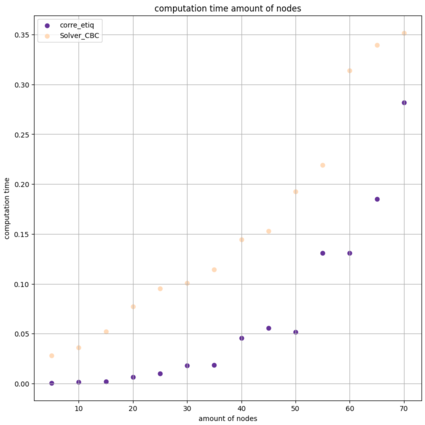
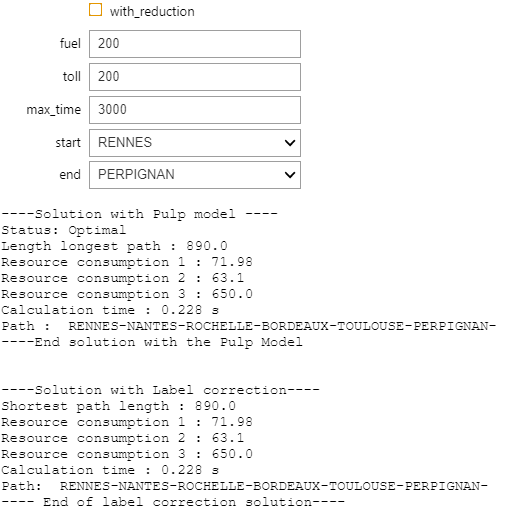
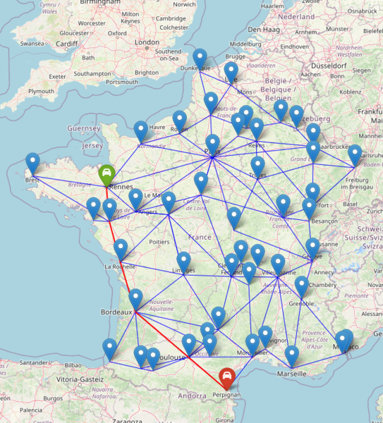
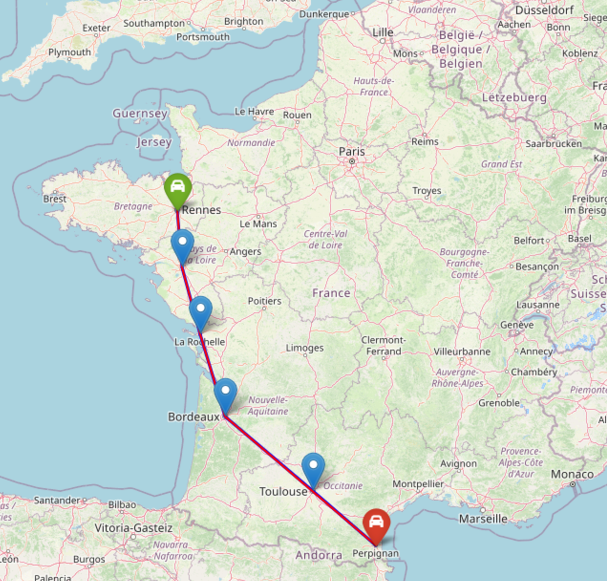

# Introduction : Description of the problem

BY 

* **CALLARD Baptiste**
* **FOSSE Loic**
* **TANNE Malo**
--- 

The shortest path in a directed graph is a very well known problem. Its solution uses dynamic programming and the most known algorithms to solve this kind of problem are of course the **dijkstra** or **Bellman-Ford** algorithms. However, what happens if we want to find the shortest path but that this path respects certain constraints, typically you want to make a trip from Pau to Rennes as short as possible in km but with a certain budget in terms of gasoline and/or tolls?

It is this problem that will interest us in the following report. From the integer linear programming associated with this problem via the **Pulp** modeling language to the graph-based resolution algorithms, we will deal with several aspects of this problem in order to better understand it.

This problem is a **NP-difficult** problem, i.e. unlike its little brother (shortest path without constraints) its solution cannot be done in polynomial time. The algorithmic complexity associated with this problem will be very important, so we will have to be very careful about our modeling in order to reduce the computation time as much as possible.

## Requirement

`pip install requirements.txt`

## Previews results

---
### Theoretical results : `CR_OD_CALLARD_TANNE_FOSSE.ipynb`
Our alogrithm allowed us to solve the problem faster than the famous GCP solver.

---
### GPS : `gps.ipynb`

We then created with our algorithm our own GPS. 
The GPS minimizes the time under the three following constraints: tolls, gasoline, distance.

The values can be modified and the result is adjusted in real time with our interface.

* The results displayed on the map correspond to our label correction.

This first pricture show the results without pre-processing.

This second image shows only the nodes after post-processing. Only useful nodes are retained.

---
### Scraping : `scrapping_OD_CALLARD_TANNE_FOSSE.ipynb`

The data was recovered by scraping with Selenium.
